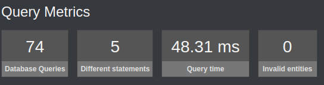
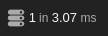
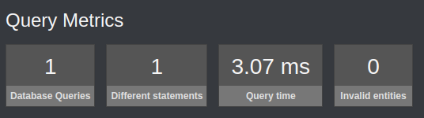

# Intro to Verclam/Smart-Fetch-Bundle
Enhance your project performance by avoiding N+1 queries with Smart Fetch Bundle.

## Latest updates

For notes about the latest changes please read [`CHANGELOG`](https://github.com/kalilovsky/smart-fetch-bundle/blob/master/CHANGELOG.md),
for required changes in your code please read [`UPGRADE`](https://github.com/kalilovsky/smart-fetch-bundle/blob/master/docs/upgrade.md)
chapter of the documentation.

## Requirements:

- Verclam/Smart-Fetch-Bundle's master is compatible with Symfony `>=5.4` versions.
- "doctrine/persistence" and "doctrine/doctrine-bundle" `>=2.2` version is required.
- PHP `>=8.0` version is required.

## Installation :

### Pretty simple with [Composer](http://packagist.org), run

```sh
composer require verclam/smart-fetch-bundle
```

## Usage :

### 1 - Configuration
Nothing to do, the bundle is ready to use, you can start using it and implement it directly to you project.

### 2 - Use in controller's method
To use the bundle in a controller's method, you have to add the `#[SmartFetch]` attribute to the parameter or the method.

```php
    #[Route('{id}/user', name: 'user_get', requirements: [ 'id' => '\d+' ], methods: ['GET'])]
    #[SmartFetch(
        queryName: 'id',
        class: User::class, 
        joinEntities: 
        [
            'articles', 
            'articles.comments', 
            'articles.categories',
            'comments.likedBy'
        ],
        argumentName: 'user'
    )]
    public function index(User $user): Response
    {

        return $this->render('user/get.html.twig', [
            'user'              => $user,
        ]);
    }
```
- `queryName`: The name of the query parameter in the URL that will be used to fetch the entity 'mandatory'.
- `class`: The class of the entity that will be fetched 'mandatory'.
- `joinEntities`: The relations that will be fetched, the order of the relation is important.
- `argumentName`: The name of the variable in the method's parameter 'mandatory if you fetch more than one entity'.

### 3 - Use in controller's parameter

```php
    #[Route('{id}/user', name: 'user_get', requirements: [ 'id' => '\d+' ], methods: ['GET'])]
    public function index(
        #[SmartFetch(
            queryName: 'id',
            joinEntities:
            [
                'articles',
                'articles.comments',
                'articles.categories',
                'comments.likedBy'
            ],
        )] User $user
    ): Response
    {

        return $this->render('user/get.html.twig', [
            'user'              => $user,
        ]);
    }
```
- `queryName`: The name of the query parameter in the URL that will be used to fetch the entity 'mandatory'.
- `joinEntities`: The relations that will be fetched, the order of the relation is important.
- `argumentName`: Not mandatory.
- `class`: Not mandatory.

### Entities
Suppose that you have a project when a `User` can post `Article` and `Comment`, a `User` can also like a `Comment`, and an `Article` can belong to many `Category`. 
The entities for this project will be like this:

#### User
```php

    // ... other properties
    #[ORM\Column(length: 255)]
    private ?string $firstname = null;

    #[ORM\Column(length: 255)]
    private ?string $lastname = null;

    #[ORM\Column(type: Types::DATETIME_MUTABLE)]
    private ?\DateTimeInterface $birthDate = null;

    #[ORM\OneToMany(mappedBy: 'createdBy', targetEntity: Article::class)]
    private Collection $articles;

    #[ORM\OneToMany(mappedBy: 'createdBy', targetEntity: Comment::class)]
    private Collection $comments;

    #[ORM\ManyToMany(targetEntity: Comment::class, mappedBy: 'likedBy')]
    private Collection $likedComments;
```

#### Article
```php

    // ... other properties
    #[ORM\Column(length: 255)]
    private ?string $title = null;

    #[ORM\Column(type: Types::TEXT)]
    private ?string $content = null;

    #[ORM\ManyToOne(inversedBy: 'articles')]
    #[ORM\JoinColumn(nullable: false)]
    private ?User $createdBy = null;

    #[ORM\ManyToMany(targetEntity: Category::class, inversedBy: 'articles')]
    private Collection $categories;

    #[ORM\OneToMany(mappedBy: 'article', targetEntity: Comment::class)]
    private Collection $comments;
```

#### Comment
```php

    // ... other properties
    #[ORM\Column(type: Types::TEXT)]
    private ?string $content = null;

    #[ORM\ManyToOne(inversedBy: 'comments')]
    #[ORM\JoinColumn(nullable: false)]
    private ?User $createdBy = null;

    #[ORM\ManyToOne(inversedBy: 'comments')]
    #[ORM\JoinColumn(nullable: false)]
    private ?Article $article = null;

    #[ORM\ManyToMany(targetEntity: User::class, inversedBy: 'likedComments')]
    private Collection $likedBy;
```

#### Category
```php

    // ... other properties
    #[ORM\Column(length: 255)]
    private ?string $name = null;

    #[ORM\ManyToMany(targetEntity: Article::class, mappedBy: 'categories')]
    private Collection $articles;
```

### Controller
Now, suppose that you want to get a `User` with all his `Article` and `Comment` and all the `Category` of each `Article` and all the `User` who liked each `Comment` of each `Article`, and to show it in a view, the controller and view.

#### Controller
```php
    #[Route('{id}/user', name: 'user_get', requirements: [ 'id' => '\d+' ], methods: ['GET'])]
    public function show(User $user): Response
    {
        return $this->render('user/show.html.twig', [
            'user' => $user,
        ]);
    }
```

#### View
```twig
    <h1>Hello {{ user }}! ✅</h1>

    The article that you created are:
    <ul>
        
            <li>
                {{ article.title }}
                This article has {{ article.comments|length }} comments which are.
                <ul>
                    
                        <li>
                            {{ comment.content ~ ' created by:' ~ comment.createdBy ~ ' and liked by :'  }}
                            
                                {{ liker }}
                            
                        </li>
                    
                </ul>
                Category:
                
                    {{ category.name }}
                
            </li>
        
    </ul>
```

### What do you think Symfony and Doctrine will do ?

Explosion, yes because the `User` in the controller will be fetched with this simple SQL query:
```sql
SELECT t0.id AS id_1, t0.firstname AS firstname_2, t0.lastname AS lastname_3, t0.birth_date AS birth_date_4 FROM user t0 WHERE t0.id = '11';
```

All the relation will be a `Proxy` and every time you will access to a relation, a new SQL query will be executed to fetch only one entity.
It's easy when the view in rendered, if you take a look on the Symfony profiler toolbar, in the `Doctrine` section , you will see it in `Yellow` color in other terms, `Warning` it's probably a `N+1` query.

Here is the query metrics:





### How to avoid this ?
With `Smart Fetch Bundle` you can fetch all the relations that you want, and you can also fetch the relations of the relations, and the relations of the relations of the relations, and so on in only `ONE QUERY`.

#### How to do it ?
After installing the bundle, the only thing that you have to do is to add the `#[SmartFetch]` attribute to the property or the methode and indicate what do you want to fetch.

#### Example:
##### Controller:
###### On the method:
```php
    #[Route('{id}/user', name: 'user_get', requirements: [ 'id' => '\d+' ], methods: ['GET'])]
    #[SmartFetch(
        queryName: 'id',
        class: User::class, 
        joinEntities: 
        [
            'articles', 
            'articles.comments', 
            'articles.categories',
            'comments.likedBy'
        ],
        argumentName: 'user'
    )]
    public function index(User $user): Response
    {

        return $this->render('user/get.html.twig', [
            'user'              => $user,
        ]);
    }
```
###### On the parameter:
```php
    #[Route('{id}/user', name: 'user_get', requirements: [ 'id' => '\d+' ], methods: ['GET'])]
    public function index(
        #[SmartFetch(
            queryName: 'id',
            joinEntities:
            [
                'articles',
                'articles.comments',
                'articles.categories',
                'comments.likedBy'
            ],
        )] User $user
    ): Response
    {

        return $this->render('user/get.html.twig', [
            'user'              => $user,
        ]);
    }
```

### What do you think Symfony and Doctrine will do ?
Nothing bad, the `User` and all the relations that you want will be fetched in only one query.
The query metrics will be like this:




Isn't it amazing ? 😍

Don't waste your time, install the bundle and enjoy it.

PS: If you're thinking of using this bundle to retrieve several hundred entities in a single query, take a pause and think again, because it won't be reasonable, Doctrine will lose his mind when hydrating thousands of rows to the entity, so our advice is to use this bundle to find the right balance between accepting a certain degree of n+1 and making joins.